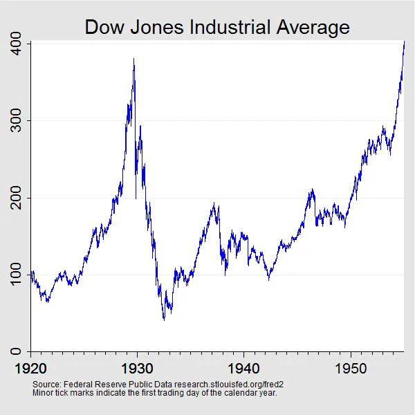
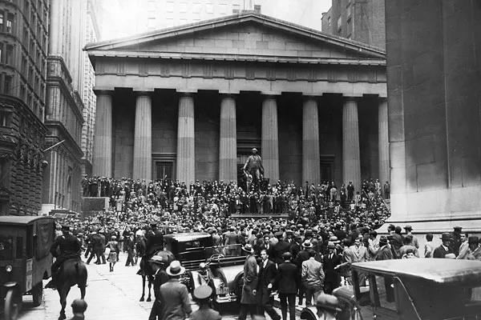
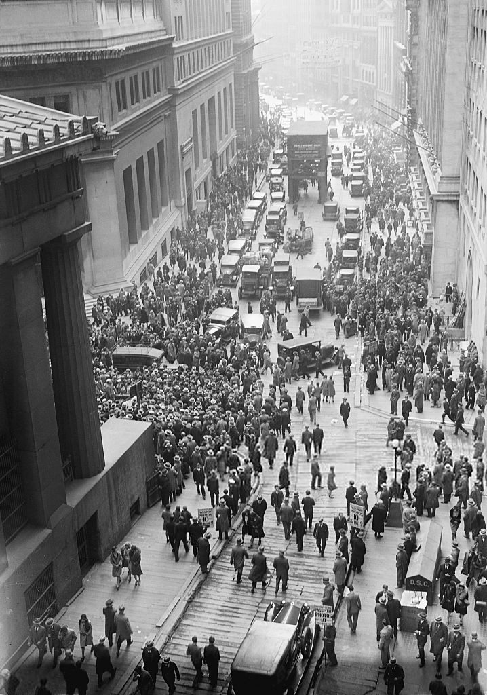
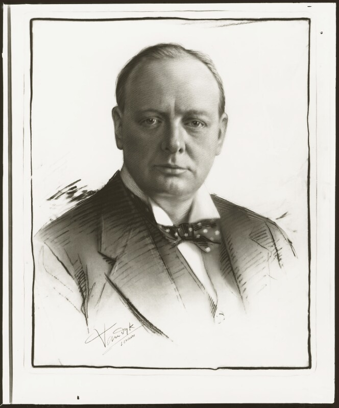
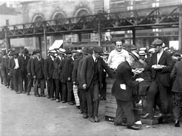
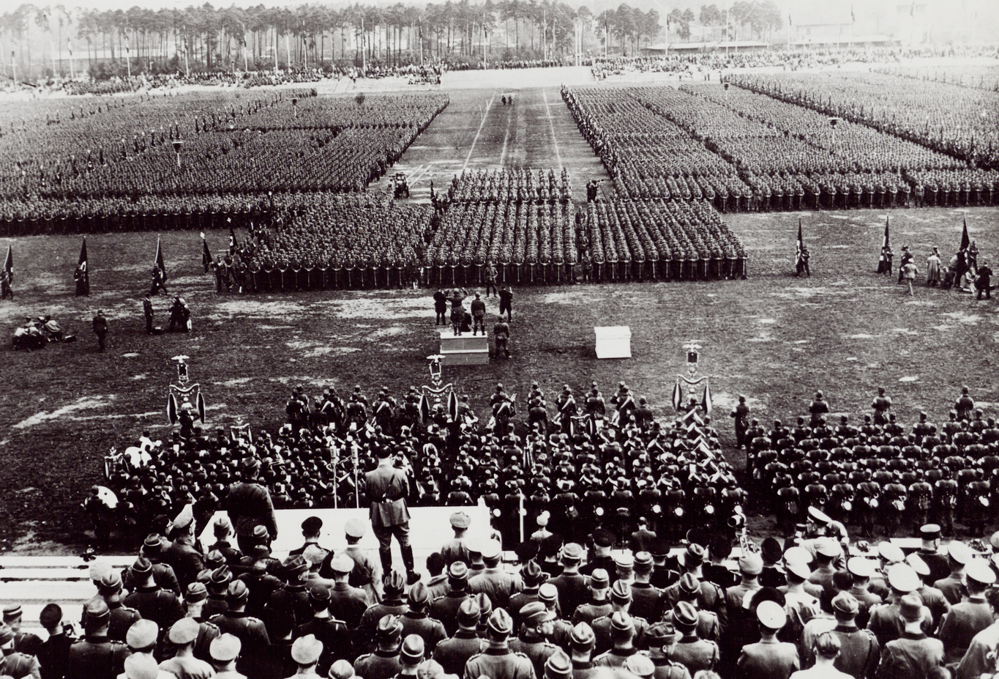
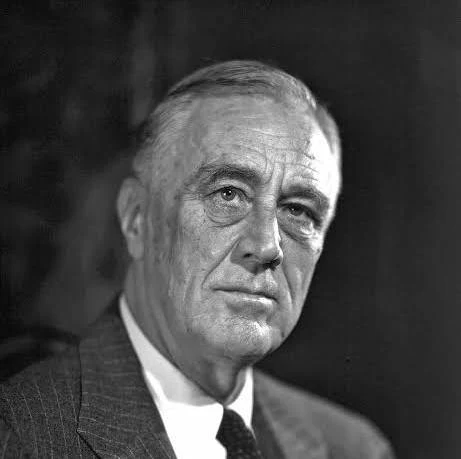
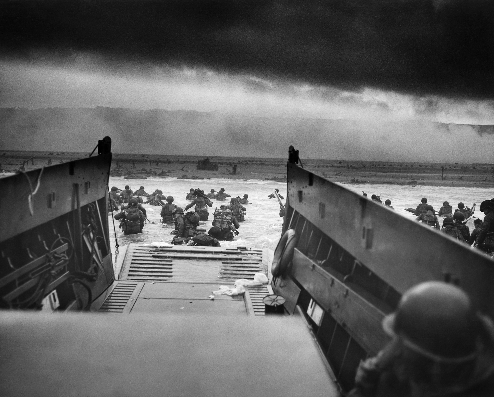
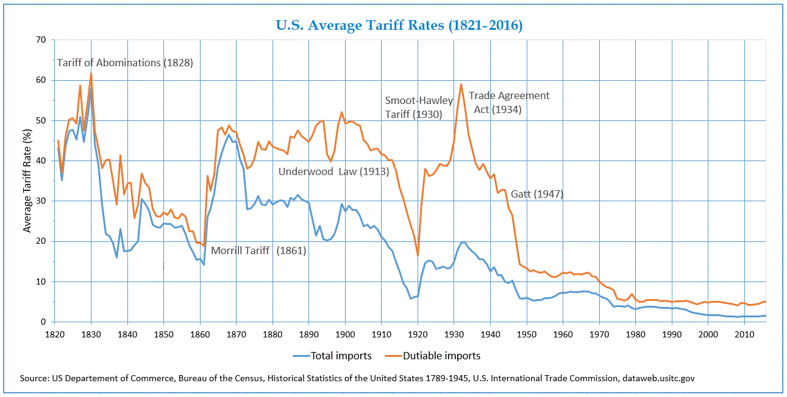

:::cover{label="01 표지"}
# 세계 대공황

자본주의를 뒤흔든 가장 큰 비상사태

:::speaker-note
- 발표 시간: 약 12분 + 질의응답 3분
- 첫 1분은 천천히 — 청중이 자세 잡을 시간
- "왜 지금 대공황을 보는가?" 도입으로 시작 (서브프라임, 코로나 비교 암시)
:::
:::

:::split{label="02 대공황이란?"}
# 대공황이란?

- :primary[1929년 미국]에서 시작되어 전세계를 뒤흔든 경제 위기
- :primary[월가 대폭락 (10/24 ~ 10/29)] 5일간 다우지수 23% 폭락하며 본격적으로 시작됨
- 약 :primary[10년간 지속]된 장기 불황 (1933년 최저점 이후 불완전한 회복)
- 산업 생산 감소 · 실업 급증 · 금융 시스템 붕괴
- :key 이후 현대 경제학과 정책 패러다임을 바꾼 매우 큰 사건

---

:::speaker-note
**핵심 메시지**: 단순한 주가 폭락이 아니라 *시스템 붕괴*. "왜 5일 만에 23%?"보다 "왜 10년이나?"를 강조.

예상 질문:
- "1929년 이전엔 호황 아니었나?" → 1920년대 광란의 호황(Roaring Twenties)이 거품을 키운 게 맞음.
- "한국에도 영향?" → 식민지 시절이라 직접 영향은 제한적, 다음 슬라이드에서 다룸.
:::
:::

:::single{label="02-1 다우 폭락"}
# 다우존스 산업평균 — 1928~1933

:::chart{type=line caption="폭락과 바닥"}
| 연도 | Dow |
|---|---|
| 1927 | 200 |
| 1928 | 300 |
| 1929 | 380 |
| 1930 | 165 |
| 1931 | 77 |
| 1932 | 60 |
| 1933 | 99 |
:::
:::

:::split{label="03 대공황의 특징"}
# 대공황의 특징

- 미국에서 시작되어 이후 유럽을 포함한 전세계로 확산
- 미국에서는 실업률 약 :primary[25%] 도달
- 세계 무역 규모 급감
- :key 단일 국가 위기를 넘어선 전세계의 자본주의를 뒤흔드는 위기

---

:::

:::divider{n=1 label="§ 진행과정"}
# 대공황의 전개
:::

:::single{label="진행과정 · 시기"}
# 대공황 시대 — 언제까지인가

- 미국의 이 시기를 :primary[Great Depression Era(대공황 시대)]라 부름
- 통상적 시기는 :primary[1929–1939년] — 주식시장 붕괴부터 2차대전 발발까지
- 다만 미국이 태평양 전쟁으로 2차대전에 본격 참전하기 전까지를 기준으로 :primary[1929–1941년]으로 보는 시선들도 있음
- :key 어느 기준을 택하든, 미국의 완전한 경제 회복은 전쟁 없이는 불가능했을 것이라 평가됨
:::

:::single{label="진행과정 · 맬런·후버"}
# 초기 대응 — 맬런의 청산 정책

- 하딩·쿨리지·후버 3개 정부에 걸쳐 :primary[11년간 재무장관]을 지낸 앤드루 맬런 — 1920년대엔 감세·재정건전화로 유능한 관료 평가
- 공황 발생 후 대응: :primary["주식·기업·노동자·농민을 청산하라"] — 구제보다 구조조정·균형재정 우선, 투자 책임은 개인에게 있다는 원칙
- 단기적으로 거품 제거·빚투 억제에는 성공했으나, 이후 :primary[디플레이션이 수년간 지속] — 농작물은 썩어가는데 서민은 살 돈이 없는 상황
- 후버, 뒤늦게 맬런을 해임하고 경기부양에 나섰으나 이미 때가 너무 늦었음
- :key "나의 정적들은 내가 혼자서 전 세계적인 대공황을 일으킬 수 있는 환상적 지성과 경제적 위력을 지녔다고 칭송했다" — 후버의 자학적 회고
:::

:::single{label="진행과정 · 뉴딜의 한계"}
# 루즈벨트의 등장과 뉴딜의 한계

- :primary[1932년 대선] — 정부 무능을 강하게 비판하던 루즈벨트 당선, 뉴딜 정책 시작
- 뉴딜(New Deal) 정책 — 정부 주도 공공사업, 즉 정부 지출로 일자리를 창출하고, 금융 규제를 강화하며, 사회보장제도를 도입한 루즈벨트의 종합 경기부양책
- 집권 1기 강력한 효과 — 빈민층의 열렬한 지지로 재선 여유 있게 달성
- 집권 2기 초반 :primary[1938년 재침체] — 회복세를 보고 의회 균형재정론자의 압박에 타협, 1937년 정부 지출을 대폭 삭감 → 회복 중이던 경기를 다시 꺾음 (폴 크루그먼: "뉴딜이 실패한 게 아니라 너무 일찍 발을 뗀 것")
- :key 뉴딜은 대공황을 완화했지만 끝내지는 못함. 하지만 사회보장제도 도입 등 제도적 유산을 남김
:::

:::single{label="진행과정 · 세계 맥락"}
# 전세계로 확산되는 공황

- 미국의 투자금 긴급 회수 → 유럽 전역 시총의 75%가 빠짐 — 특히 독일은 :primary[실업률 최대 44%]를 달성하여 반붕괴
- 대공황을 안겪은 지역 — :primary[플로리다]: 1925–26년 부동산 버블이 먼저 터져 거품이 이미 제거된 상태 → 역설적으로 대공황을 거의 안겪음. 그냥 3년 일찍 공황을 겪어버림
- 금본위제(후술) 이탈 순서대로 회복 — 영국(1931), 미국(1933) 이후 각국 통화정책 여력 회복
- :key 완전 회복은 2차대전이 만든 수요 — 군수 동원으로 실업률 1%대, 유럽의 무기 구매로 미국에 달러·금 집중
:::

:::single{label="08-1 실업률 비교"}
# 실업률 (%) — 미국 vs 독일 (1929~1933)

:::chart{type=bar caption="진원지보다 더 깊었던 독일의 침체"}
| 연도 | 미국 | 독일 |
|---|---|---|
| 1929 | 3 | 9 |
| 1930 | 9 | 15 |
| 1931 | 16 | 23 |
| 1932 | 24 | 30 |
| 1933 | 25 | 26 |
:::
:::

:::divider{n=2 label="§ 원인"}
# 대공황은 왜 발생하였는가
:::

:::split{label="원인 · 복잡성"}
# 원인을 하나로 특정할 수 없다

- 대공황은 :primary[단일 원인으로 설명되지 않는다] — 경제·통화·구조·정책 실패가 동시에 맞물린 사건
- 대체 정확히 어떻게 발생하게 되었는지에 대해서도 현재까지 명쾌한 설명은 없음
- :key 시장의 위축에 따른 비대한 경제 구조의 붕괴 + 이를 막아야 할 적절한 정책의 부재 — 이것이 현재까지의 합의 내용

---

:::

:::single{label="원인 · 가설 ①"}
# 가설 ① 지출 가설 — 유효수요의 붕괴

- 1920년대, 할부·신용 구매가 보편화되며 사람들이 :primary[실제 소득보다 더 많이 소비](빚으로 메꿈). 기업은 늘어난 수요를 보고 생산을 늘림 — 그러나 정작 소득은 안 늘었고 부는 상위 계층에만 집중, 내수 기반 자체가 부실한 채로 성장
- 1929년 주가 폭락 → 자산가치 증발·신용 경색 → 할부·신용 구매 불가 → :primary[수요가 한꺼번에 꺼짐] → 재고 폭증, 기업 감원·감산
- 일자리를 잃은 사람들은 소비를 더 줄이고, 기업은 생산을 더 줄이는 :primary[악순환]. 부유층은 돈이 있어도 쌓아두기만 함
- 정치인들은 실업이 급증하는 와중에도 :primary[균형재정]에만 집착하며 정부 지출을 늘리지 않음 — 경제를 살릴 마지막 수단마저 포기
- :key 소비(민간)·투자(기업)·지출(정부), 경제를 돌리는 세 바퀴가 동시에 멈춰버렸다
:::

:::single{label="원인 · 가설 ②"}
# 가설 ② 통화 가설 — 통화승수의 붕괴

- 주가 폭락 이후 "은행도 망할 수 있다"는 공포가 퍼지며 사람들이 일제히 예금을 인출 → :primary[뱅크런(Bank Run)] 발생 → 은행 파산 연쇄 (3년간 9,000개+)
- 살아남은 은행들도 "또 언제 뱅크런이 올지 모른다"며 대출을 극도로 줄이고 지급준비금을 쌓아둠 → 돈이 금고 안에 갇혀버림. 연준이 본원통화를 :primary[18% 늘렸음에도] 시중 통화량은 오히려 급감 (통화승수 38% 폭락)
- 시중에 돈이 없으니 기업도 투자 못하고 사람도 소비 못 함 → 물가 하락(디플레이션) 시작
- 디플레이션이 시작되면 :primary["지금 사는 것보다 기다리면 더 싸지겠지"] → 소비·투자를 더 미룸 → 경기 더 악화 → 물가 더 하락의 악순환
- :key 프리드먼은 대공황이 시장의 실패가 아니라 중앙은행의 정책 실패라고 평가함
:::

:::single{label="원인 · 가설 ③"}
# 가설 ③ 금본위제 함정 — 금이 돌지 않았다

- :primary[금본위제(Gold Standard)] — 각국 통화를 금과 연동하는 시스템. 금이 있어야 돈을 찍을 수 있고, 금이 유입된 나라는 돈을 풀어 인플레이션이 생기고, 금이 나간 나라는 돈이 줄어 디플레이션이 생겨 자동으로 균형을 맞추는 구조
- 1차 대전 이후 각국이 금본위제로 복귀하는 과정에서 영국은 파운드를 높게, 미국·프랑스는 낮게 설정 → :primary[금이 미국·프랑스로만 쏠림]. 원래라면 두 나라에서 인플레이션이 생겨 금이 다시 나가야 하는데—
- 미국·프랑스는 금이 들어와도 돈을 풀지 않고 창고에 쌓아둠 (1차대전 초인플레이션 트라우마). 그러자 나머지 나라들은 금이 빠져나가는데 금본위제 때문에 :primary[돈을 찍을 수도 없게 됨] — 시중에 돈이 말라가며 디플레이션 심화. 거기다 금이 더 빠져나가는 걸 막으려면 금리를 올려야 하는데, :primary[불황인데 금리까지 올리니] 경기가 더 악화되는 악순환
- 금본위제가 아니었던 스페인, 은본위제였던 중국은 대공황을 겪지 않았고, :primary[금본위제를 이탈한 순서대로 경기가 회복]됐다 (영국 1931, 미국 1933)
:::

:::split{label="09 영국 사례"}
# 실제 사례 — 영국은 어떻게 됐나

- 1차 대전 전비 폭증으로 파운드화 가치 급락. 전후 영국은 잃어버린 위상을 되찾기 위해 :primary[1925년 금본위제 복귀]를 선택 — 이게 문제의 시작
- 복귀 당시 파운드를 실제 가치보다 :primary[높게 설정]했다. 쉽게 말해, 영국 물건값이 해외에서 더 비싸 보이게 된 것 → 수출 감소 → 이미 전쟁 후유증이 있던 경제가 더 침체
- 그 상태에서 대공황이 터지자 더 이상 버티지 못하고 :primary[1931년 금본위제 포기] — 포기하자마자 파운드 가치가 내려가고 수출 경쟁력이 회복되며 경기도 살아나기 시작
- :key 금본위제를 고집한 기간만큼 불황이 길어졌다 — 그리고 파운드의 기축통화 지위는 이때를 기점으로 사실상 달러에게 넘어갔다

---

:::

:::single{label="원인 · 가설 ④"}
# 가설 ④ 구조적 거품과 자유방임의 실패

- 1920년대 감세로 유동자금이 넘쳐났고, 그 돈이 주식시장으로 몰리기 시작. 라디오·자동차 등 신산업 투기 열풍에 마진거래(빚을 내서 주식 투자)까지 더해지며 거품이 부풀어짐 — 가계자산 대비 주식 비중 :primary[51%], 닷컴버블보다도 극단적인 수치
- 당시 관료들도 과열을 알고 있었지만 :primary["시장이 알아서 해결한다"]는 자유방임 신념으로 방치 → 1929년 거품 붕괴
- 거품이 터지자 마진거래 투자자들이 강제 매도(마진콜)에 내몰리며 주가 폭락을 더 가속화. 이후에도 관료들은 :primary["곧 회복되겠지"]라며 개입 거부, 위기가 공황으로 심화
- 오스트리아학파는 반대 방향에서 같은 결론에 도달 — 1920년대 연준의 지나친 신용 완화 자체가 거품을 만들어낸 :primary[정부 실패]였다는 것
:::

:::single{label="10 음모론"}
# 대공황의 '진짜' 원인?

- 프리메이슨 · 일루미나티 비밀결사가 세계 경제를 의도적으로 붕괴시켰다는 설
- 배후는 로스차일드 가문의 뒷배설 (단, 정작 본인도 대공황 피해자)
- 소련의 자본주의 붕괴 공작설
- 1차 대전 · 대공황 · 2차 대전이 전부 하나의 "역사 개편 작전"이라는 설

::note[학술적으로 검증된 내용이 아닙니다 — 그리고 검증될 가능성도 없습니다]
:::

:::divider{n=3 label="§ 여파"}
# 세상은 대공황을 어떻게 맞이하였는가
:::

:::single{label="11 여파 · 경제"}
# 대공황의 여파 — 경제

- 4년 만에 미국 1인당 GDP 반토막 (:primary[\$859 → \$455], 1929→1933) — 수치가 아니라 수백만 명이 직장·저축·집을 잃었다는 뜻
- 주식 시가총액의 :primary[88.88%]가 3년 새 증발 — 1929년에 투자한 1달러가 1932년엔 11센트
- 미국이 유럽에 빌려준 돈을 긴급 회수하면서 유럽 경제도 직격 → 유럽 시총 :primary[기존의 1/4 수준]으로 붕괴, 위기가 대서양을 넘어 전 세계로 번짐
- :key 독일은 실업률이 44%를 찍음 — 진원지인 미국(25%)보다도 피해가 컸음

:::stats
::stat[−88.88%]{label="미국 시가총액" primary}
::stat[약 −60%]{label="세계 무역"}
::stat[9,000+]{label="은행 파산 (US)"}
:::
:::

:::split{label="12 여파 · 사회"}
# 대공황의 여파 — 사회

- 미국도 실업률 최대 :primary[25%] 찍음 — 4명 중 1명이 직장이 없었고, 비공식 취업자·임시직까지 포함하면 체감 실업률은 훨씬 높았음
- 일자리를 잃은 사람들이 도시 곳곳의 :primary[무료 급식소(Bread Line)] 앞에 빵을 받으러 줄을 서는 것이 일상 풍경이 됨 — 중산층도 예외가 없었다
- 농촌도 직격 — 농산물 가격 폭락으로 농가 수입이 사라졌고, 오클라호마 등 중부 지역은 대가뭄(더스트 볼)까지 겹쳐 대규모 이주 난민 발생
- :key 경제 위기는 사회 전반의 신뢰 붕괴로 이어짐 — 기존 체제에 대한 불신이 커지며 추후 급진적 정치운동의 토양이 되기도 함

---

:::

:::split{label="13 여파 · 정치"}
# 대공황의 여파 — 정치

- 각국이 자국 산업을 지키려고 관세 장벽을 높이기 시작(보호 무역)하면서, 세계 무역이 줄어들고 나라마다 자기 편끼리만 교역하는 블록으로 쪼개짐 (영국은 영연방, 프랑스는 식민지끼리)
- 경제가 무너지자 기존 정치에 대한 신뢰도 무너짐 → 극단적 정치 운동의 지지 기반 확대
- 가장 극단적인 사례가 독일 — 전쟁 패전·베르사유 조약의 굴욕에 경제 파탄까지 겹치자 급진 정당의 지지율이 폭등. :primary[나치당 의석 12석(1928) → 104석(1930)] — 2년 만에 8배
- :key 경제 붕괴가 극단적 정치의 불씨에 기름을 부은 셈

---

:::

:::divider{n=4 primary label="§ 해결"}
# 대공황은 어떻게 수습되었는가
:::

:::split{label="14 뉴딜 정책"}
# 해결 과정

- F. D. Roosevelt 취임 직후 "100일 입법"으로 대규모 개혁 시작 — 당시 의회도 위기를 충분히 체감하고 있어 법안들이 빠르게 통과됨
- 공공사업(정부 지출)으로 일자리 직접 창출 — TVA(테네시강 유역 개발), 도로·댐·공항 건설 등으로 수백만 명 고용
- :primary[Glass-Steagall Act] — 고객 예금으로 투기를 하던 은행들이 문제의 핵심이었으니, 투자은행과 상업은행을 아예 법으로 분리
- 사회보장제도(Social Security) 도입 — 노후 연금 · 실업급여 등, 지금 우리가 당연하게 여기는 복지제도가 이때 처음 생김

---

:::

:::single{label="15 해결 과정"}
# 해결 과정

- 1933년 금본위제 이탈로 통화 완화 → 금리·신용 회복 시작. 금이라는 족쇄를 푸는 것만으로도 숨통이 트이기 시작
- :primary[FDIC(연방예금보험공사)] 설립 — "은행에 돈을 맡기면 국가가 보장해준다"를 시전 → 뱅크런 공포가 해소되며 은행 시스템 안정
- 재정 지출 확대와 금융 규제 강화가 맞물리며 경기 서서히 회복 — 단, 이것만으로 완전 회복은 불가능했음(1938년 재침체가 그걸 증명함)
- :key 경기 회복의 마침표는 결국 뉴딜이 아니라 2차대전이 찍어버림
:::

:::single{label="15-1 실업률 추이"}
# 미국 실업률 — 1929~1944

:::chart{type=line caption="전쟁이 만든 회복"}
| 연도 | 실업률 |
|---|---|
| 1929 | 3 |
| 1932 | 24 |
| 1933 | 25 |
| 1936 | 17 |
| 1938 | 19 |
| 1940 | 15 |
| 1941 | 10 |
| 1942 | 5 |
| 1943 | 2 |
| 1944 | 1 |
:::
:::

:::split{label="16 WWII"}
# WWII

- 2차대전 발발 → 군수 생산 수요 폭발 — 사람들이 전장으로 나가고, 공장이 무기·탄약·군복 생산으로 전환되고, 실업자들이 군인과 군수공장 노동자로 흡수됨
- 실업률: 9.9%(1941) → 4.7%(1942) → 1.9%(1943) → :primary[1.2%(1944)] — 뉴딜 10년이 못 한 것을 전쟁 3년이 해냄
- 유럽이 미국에서 무기·물자를 사들이면서 달러와 금이 미국으로 집중 → 전후 달러 패권 체제(브레튼우즈)의 기반이 됨
- :key 즉, 경기 회복의 마침표는 결국 뉴딜이 아니라 2차대전이 찍어버림

---

:::

:::divider{n=5 label="§ 결론"}
# 대공황의 교훈
:::

:::single{label="17-1 케인스 경제학"}
# 교훈 ① 케인스 경제학의 등장

- 대공황 이전 주류 경제학의 입장 — "시장은 스스로 균형을 찾는다. 정부가 개입하면 오히려 방해가 된다."
- 대공황은 이 믿음이 현실에서 무너지는 과정을 10년에 걸쳐 보여줌
- :primary[케인스(Keynes)의 주장] — 민간 소비·투자가 무너진 상황에선 정부가 직접 돈을 써서 수요를 만들어야 한다. 불황일수록 정부 지출을 늘려야 한다는 "유효수요 이론"
- 뉴딜을 거치며 실증됐고, 2차대전 이후 서방 선진국의 표준 경제 정책으로 자리잡음. 지금도 경기 침체 때마다 각국 정부가 재정 지출 확대를 논의하는 것이 케인스주의의 유산
- :key 반론도 있긴함 — 1970년대 스태그플레이션을 계기로 "정부 개입이 오히려 문제"라는 통화주의·신자유주의가 부상하며 지금도 논쟁 중
:::

:::single{label="17-2 중앙은행"}
# 교훈 ② 중앙은행의 역할

- 대공황 때 연준이 뱅크런과 통화 붕괴를 방치한 것이 공황을 심화시켰다는 반성 → 이후 중앙은행은 위기 때 :primary[적극 개입해야 한다]는 원칙이 확립됨
- 2008년 :primary[서브프라임 모기지 사태] — 대공황 연구자 출신이였던 버냉키 연준 의장이 의도적으로 유동성을 공급함. "이번엔 연준이 손 놓지 않겠다"는 의지가 반영된 대응
- 우리나라 사례 — 1997년 외환위기 때 IMF 구제금융. 당시 한국은행이 금리를 급격히 올려 외환을 방어했고 이후 외환보유액 관리와 한국은행의 독립성이 대폭 강화됨
- :key 2020년 코로나 때도 각국 중앙은행이 전례 없는 속도로 금리를 내리고 돈을 풀었음 — 대공황의 교훈이 그대로 적용된 사례
:::

:::single{label="17-3 사회보장제도"}
# 교훈 ③ 사회보장제도의 탄생

- 대공황 이전엔 실직하면 그냥 굶는 것이 당연했다. 정부 차원의 안전망이 없었고, 그래서 수백만 명이 한꺼번에 빈곤으로 내몰렸을 때 사회가 그냥 무너졌다
- 뉴딜의 :primary[Social Security Act(1935)]가 기틀 — 실업급여·노후 연금을 국가가 보장하는 제도. 이후 2차대전을 거치며 영국·북유럽 등 서방 복지국가 모델로 확산
- 우리나라의 경우 1977년 의료보험, 1988년 국민연금, 1995년 고용보험, 1999년 국민기초생활보장법 탄생. 지금 우리가 쓰는 4대보험 체계는 대공황 이후 전 세계에 퍼진 복지국가 모델이 한국에 정착한 것
- :key 사회안전망은 복지도 하지만 경제적 안정 장치의 역할도 함. 위기가 와도 소비가 일정 수준 이하로 무너지지 않게 하는 바닥재 역할을 함.
:::

:::split{label="18 현재와의 비교"}
# 역사는 반복되는가 — 2025년 무역전쟁

- 2025년 트럼프 행정부의 상호관세로 미국 실효 관세율이 :primary[2.5% → 27%]로 급등 — 1930년 스무트-홀리 관세법(약 20%) 수준을 이미 넘어섰다
- 각국의 보복 관세도 뒤따름 — 1930년대처럼 전면적 블록화로 가지는 않았지만, 중국·EU·캐나다가 미국의 핵심 산업을 겨냥한 핀셋형 보복으로 대응
- 다른 점이 있긴함 — 지금은 세계 경제가 훨씬 더 얽혀 있고, 협상과 완화가 병행됨
- :key 그래도 관세 전쟁이 불황을 더 깊게 만들었다는 1930년대의 두려움이 느껴지긴함

---

:::

:::cover{variant=close label="감사합니다"}
# 감사합니다
:::
